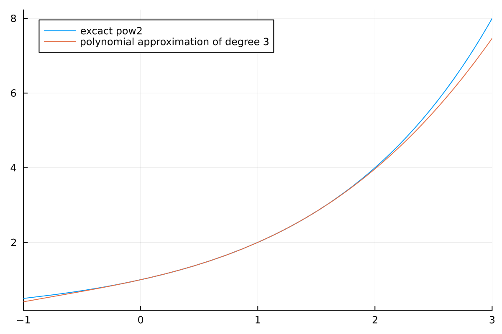

# Custom Floating point implementation in C++
This repo is mainly for educational purposes for those who want to understand how floating-point arithmetic like in IEEE754 basically works. Technically, floating point implementations use a data structure encoding
- the sign
- the exponent
- the mantissa


of a number. On this data structure we implement basic mathematical operations like addition, subtraction and multiplication. As a little extra we demonstrate the idea how more advanced mathematical functions like the base-2 logarithm, square root, and power functions can be implemented. 

I wrote this implementation specifically for the Warthog cryptocurrency, so it supports only those operations that I needed. For example division is not implemented here (but can basically implemented using a 64 bit temp variable containing the dividend shifted by 32 bytes to the left and then using standard integer division, then shifting back and adjusting correctly for the exponent).

This implementation is just right for the intended use case I wrote it for because it is platform independent. In a cryptocurrency, it would be a bad idea to use floating point arithmetics because compilers can apply optimizations which may change the result when flags like `-ffast-math` are used. This would break consensus across the network.
While in principle it would be possible to use standard IEEE754 floating point arithmetic in consensus-critical parts of a cryptocurrency implementation by restricting compiler flags carefully in each build, I consider this to be very fragile and very bad style.

The implementation does not support denormalized floating point numbers, NAN or INF. Instead, following the fail-fast principle which states that software "should be as vulnerable as possible to internal errors" (as Pieter Hintjens once put it) I excessively use `assert`s all over the place to avoid unexpected results from corner cases. This is an additional advantage of this implementation over standard floating point arithmetic when used in a cryptocurrency implementation.

## Class representing a number
We use the following structure to represent floating-point numbers:
```
class CustomFloat{
        uint32_t _mantissa;
        int32_t _exponent;
        bool _positive { true };
}
```
The exponent is with respect to base 2. The mantissa must be
- either 0 which represents the number 0 irrespective of the other parameters
- or it must be normalized (greater than `0x80000000u`), i.e. the highest bit must be positive.


## Operations
We now describe the idea that is used for different mathematical operations:
### Addition
For addition we have to check for different cases:
 - if one number is zero return the other.
 - if the numbers have equal sign (both positive or both negative) we just need to add by by shifting right the mantissa of the number with the smaller exponent by the difference in exponents and then add the mantissa. If the mantissa sum is greater than (`1<<32`), we must normalize the number again by right-shifting the mantissa and increasing the exponent to compensate the right-shift.
 - If the numbers have different sign, we assume without loss of generality that the first exponent is greater than or equal to the second exponent. 
   - if the exponents are equal we just need to subtract the mantissa
	   + if both mantissa are equal return 0
	   + subtract the smaller mantissa from the bigger mantissa and switch sign if necessary.
   - if the exponents are not equal right-shift the second mantissa by the difference in exponents. Then subtract this number from the first mantissa. Finally normalize the number again by left-shifting and reducing the exponent if necessary.
   
### Multiplication
 - if one number is 0 return 0
 - multiply the mantissa in 64 bit mode and right-shift by 31 bytes
 - add the exponents and normalize by left-shifting and increasing exponent if necessary.
 
### Base-2-Logarithm
Use a polynomial approximation of the base-2 logarithm in the interval [0.5,1] as in the following Julia code:

```julia
function fastLog(x::Float64)
    c =[ 1.33755322, -4.42852392, 6.30371424, -3.21430967 ];
    return ((c[1]*x+c[2])*x +c[3])*x+c[4]
end
```
 

Now note that each positive number can be represented as $x= 2^em$ 
with an integer exponent $e$ and a number $m$ in the interval $[0.5,1]$.

The logarithm is then simply `e+fastLog(m)`.

### Base-2 Exponentiation
Use a polynomial approximation of the base-2 power function in the interval [0,1] as in the following Julia code:
```julia
function fastPow2(x::Float64)
    c =[ 0.09335915850659268, 0.2043376277254389, 0.7019754011048444, 1.00020947 ];
    return ((c[1]*x+c[2])*x +c[3])*x+c[4]
end
```
 
Now note that each number is the sum of an integer `e` plus another number `r` in $[0,1]$.

The result of the operation is then simply `2^(e)*fastPow2(r)`.
### Power function
Use $a^b = 2^{(b \log_2(a))}$ to reduce to the above operations.
### Square root
Use $\sqrt{a} = a^{0.5}$ to reduce to above operations.

# The code
The code is contained in a header-only file `src/custom_float.hpp`.
